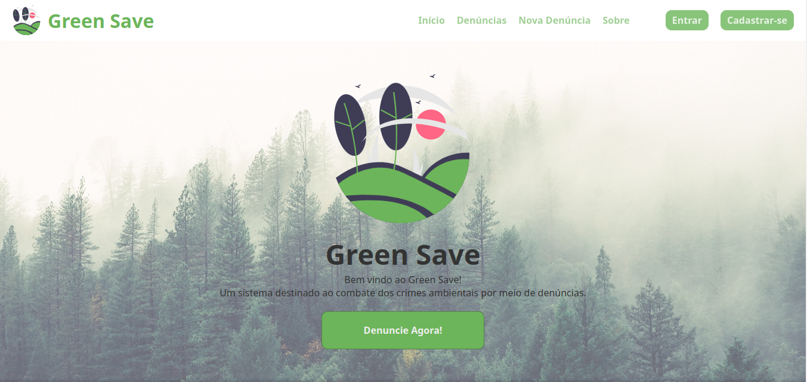

# Green Save



Sistema básico para denúncias de crimes ambientais, criado para o processo seletivo pechinchou 02-2022.

## Execução

1. Clone o repositório

```bash
git clone https://github.com/WillianM19/Selecao-02-2022-Pechinchou
```

2. Instale as dependencias

```bash
npm install
```

3. Crie uma build

```bash
npm run build
```

4. Execute o projeto

```bash
npm start
```

## Checklist do projeto

- [x] Cadastro e Login
  
- [x] Registro de denúncias
  
- [ ] Editar denuncias
  
- [x] Apagar denúncias
  
- [ ] Filtragem de denúncias
  

## Mais Informações

- Tempo para estudo, criação e entrega do projeto: 6 Dias

## Outras Screenshots

**Login**


**Cadastro**


**Denúncia**


**Denúncias**
